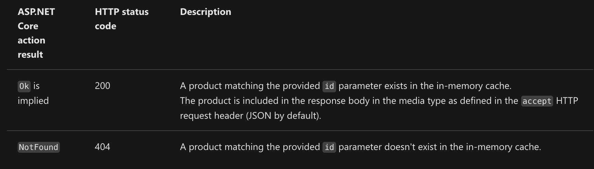
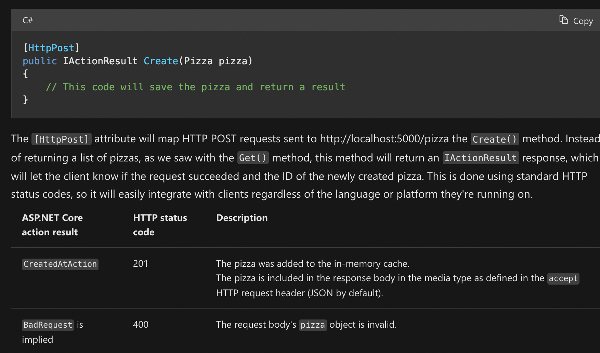
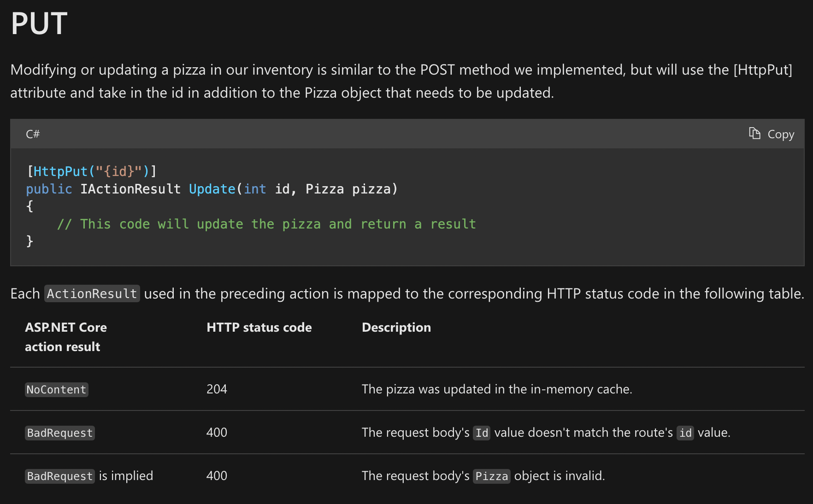
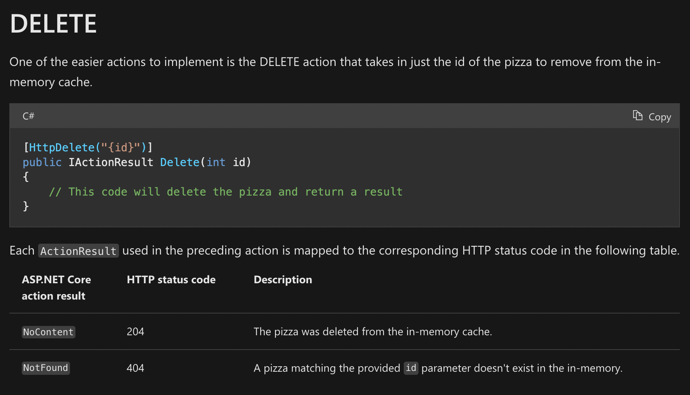

# Purpose

Just trying to learn a bit about REST APIs with C#.

# Installation tips

## How the starter repo is created

We build a placeholder ASP.NET API with the following:

```
dotnet new webapi -f net6.0
```

From there you can run the REST API with `dotnet run`, this will show you your API's endpoints  
Connect to one of the API ports using the Microsoft HTTP REPL as follows

```
httprepl
connect [your endpoint]
ls

```

## The Microsoft HTTP REPL

The Microsoft HTTP REPL allows us to debug our application more easily.

```
dotnet tool install -g Microsoft.dotnet-httprepl
```

# Issues I ran into

## "Unable to find an OpenAPI description" on HTTPREPL connect

See [this](https://stackoverflow.com/questions/69278068/why-is-httprepl-unable-to-find-an-openapi-description-the-command-ls-does-not)  
What fixed the issue for me:

```
dotnet dev-certs https --trust
```

# Results of actions

## GET



## POST



## PUT



## DELETE


